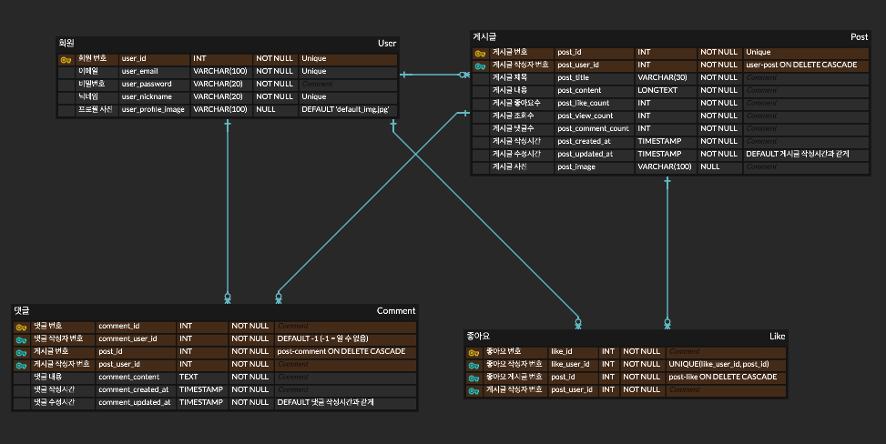

# 😋 맛추픽추

> 카카오 부트캠프 풀스택 6차 과제 (Backend)


맛추픽추의 백엔드는 **Spring Boot** 기반의 REST API 서버로,  

사용자 관리, 게시글 작성, 댓글, 좋아요 기능을 제공합니다.

## ✅ 프로젝트 소개

이 프로젝트는 지인들끼리 서울 맛집 정보를 쉽게 공유할 수 있도록 기획되었습니다.  
맛집 정보와 후기 게시글을 올리고, 댓글과 좋아요를 통해 소통할 수 있습니다.

## ✅ 개발 기간 / 인원 / 기술 스택

- 개발 기간 : 2025.03.16-2025.03.30
- 개발 인원 : 1명
- 기술 스택 : Java / Spring Boot / MySQL / Postman
- <a href="https://github.com/100-hours-a-week/2-kylie-cho-community-fe">맛추픽추 Frontend Github</a>

## ✅ API 기능
1. 게시글 관리
   - 게시글 목록 조회
   - 게시글 상세 조회
   - 게시글 작성
   - 게시글 수정
   - 게시글 삭제
   - 게시글 조회수 조회

2. 댓글 관리
    - 댓글 작성
    - 댓글 수정
    - 댓글 삭제
    - 댓글 조회
    - 댓글수 조회
   
3. 좋아요 관리
    - 게시글에 좋아요 추가
    - 좋아요 취소
    - 게시글 좋아요수 조회

## ✅ ERD


## ✅ 프로젝트 폴더 구조
```
   📦 community_be
   ├── 📂 src/main/java/__kylie_cho/community_be
   │    ├── 📂 config # 설정 파일
   │    ├── 📂 controller # API 컨트롤러
   │    ├── 📂 dto # 데이터 전송 객체 (DTO)
   │    ├── 📂 entity # JPA 엔티티
   │    ├── 📂 repository # 데이터베이스 인터페이스
   │    ├── 📂 service # 비즈니스 로직
   │    └── 📜 CommunityBeApplication.java # 메인 애플리케이션
   └── 📜 application.properties # 환경 설정
```

## ✅ 회고
### 트러블 슈팅
- DB 속성명

   id처럼 엔티티 간 중복되는 속성명이 있으면 나중에 헷갈릴 것 같아 속성명 앞에 엔티티명을 포함하여 ERD를 설계했다.

   그런데 코딩 후 생성된 DB를 보니 실행 과정에서 자동으로 엔티티명을 앞에 붙여줘서

   post_post_user_id 같은 엄청나게 헷갈리는 속성명이 되어버리는 문제가 생겼다.

   아무래도 개발하면서 스스로도 혼란이 생길 것 같아 속성명 관련 코드를 전부 변경했다.

- DTO 작성

   dto를 작성해야 한다는 것을 잊고 있었다.

   연동 후 로그인을 시도하니 UserController에서 요구하는 파라미터의 형식과 FE에서 보내는 데이터의 형식이 다르다는 에러가 발생했다.

   이러한 이유로 dto가 꼭 필요하다는 것을 깨달았고, dto를 작성한 후 로그인을 다시 시도하니 성공했다.

   dto를 이용하니 Service, Controller의 코드가 더 깔끔해졌고, 유지보수 측면에서 훨씬 좋다는 생각이 들었다.

### 어려웠던 점
- like 엔티티 관련 에러

  `LIKE`는 MariaDB에서 예약어 역할을 하기도 한다.
  
   그걸 떠올리지 못한 상태로 like 엔티티를 만들었더니 이와 관련해 계속 에러가 발생했다.
  
   like 엔티티명을 heart로 변경하여 에러를 해결했다.

   개발이 한참 진행된 후에 likes로만 바꿔도 에러가 발생하지 않아 보통 그렇게 테이블명을 작성한다는 것을 알게 되었다.

- JPQL 사용

   마침 엔티티 매니저에 대한 수업을 들어서 처음에는 JPQL을 활용해 SQL 쿼리를 하드코딩했다.

   그런데 코드를 수정하다보니 하드코딩한 부분은 직접 수정해줘야 해서 불편했다.

   고민하다 JPQL 대신 JpaRepository 메서드로 수정했다.

   코드가 훨씬 간결하고 직관적으로 이해하기 빠르며, 자주 수정해줘야 하는 번거로움이 줄어들었다.

- 순환참조 방지

   User-Post를 양방향 관계로 설정하니 순환참조가 발생해 응답 데이터가 엄청 길어지는 문제가 발생했다.

   직렬화 시 참조에 포함할지 말지 제어할 수 있는 어노테이션을 사용해 문제를 해결했다.

   `@JsonManagedReference`는 직렬화 시 참조하도록,

   `@JsonBackReference`는 직렬화 시 참조하지 않도록 설정하는 것이다.

   직렬화 개념 정리 시간에 잘 이해가 되지 않았는데 직접 요청하고 응답을 확인하니 직관적으로 이해됐다.

- 엔티티 필드 수정

   ERD를 작성하는 단계에서 Comment와 Heart 엔티티 속성으로

   게시글의 아이디와 해당 게시글을 작성한 사용자의 아이디를 모두 저장해야겠다고 생각했다.

   그래서 연관관계로 User, Post, postUser를 설정하고, post_id, post_user_id를 외래키로 설정했다.

   코드를 구현하다보니 잘못 설계했다는 것을 깨달았다.

   연관관계인 Post를 통해 게시글을 작성한 사용자의 아이디까지 얻을 수 있기 때문에 postUser 연관관계를 설정할 필요가 없는 것이었다.

   postUser 연관관계를 제거하고, DB에 post_user_id가 남아있어 DB 내 테이블을 모두 삭제하고 다시 생성했다.

   이를 통해 데이터 중복 저장을 방지하고 데이터 일관성을 높였다.

### 아쉬웠던 점
- Join

   일대다 관계를 형성하면 join이 어떻게 작동하는지 백엔드 터미널에서 확인 가능하다.

   그런데 직관적으로 와닿지 않아서 join이 얼마나 발생했는지, 어떤 부분에서 코드를 비효율적으로 작성한건지 파악하기가 어려웠다.

   join 관계를 파악하고 더 효율적인 관계 설정 및 코드 작성을 하는 경험을 가지고 싶다.

- DTO 활용
  
   dto 작성 전에는 Controller에서 파라미터를 받을 때 @PathVariable, @RequestBody, @RequestParam을 임의로 섞어 사용했다.

   dto를 활용하면 @RequestBody로 통일하여 일관성 있는 코드를 작성할 수 있다는 것을 알게 되었다.

   마지막 HeartController를 수정할 때쯤 깨닫게 되어 나머지 Controller에 대해 모두 @RequestBody로 통일하지 못한 것에 대해 아쉬움이 남는다.

- 댓글 관련 api 연동

   댓글 관련해서는 게시글 아이디와 유저 아이디가 필요하다.

   이 부분을 백엔드에서 넘겨받는 코드를 작성하는 것이 매우 어렵게 느껴졌다.

   백엔드에서 댓글 삭제 시 api를 /api/comments/{commentId} 같은 형식으로 매핑해둬서

   게시글 아이디와 유저 아이디는 쿼리 파라미터로 전달 받아야 했는데 이것을 구현하는 것이 헷갈렸다.

   이 부분에 대해서는 훨씬 더 많이 연습해봐야 할 것 같다.

## ✅ 향후 개발 계획
- 좋아요 여부 API 최적화
- JWT 기반 인증 추가
- 테스트 코드 추가